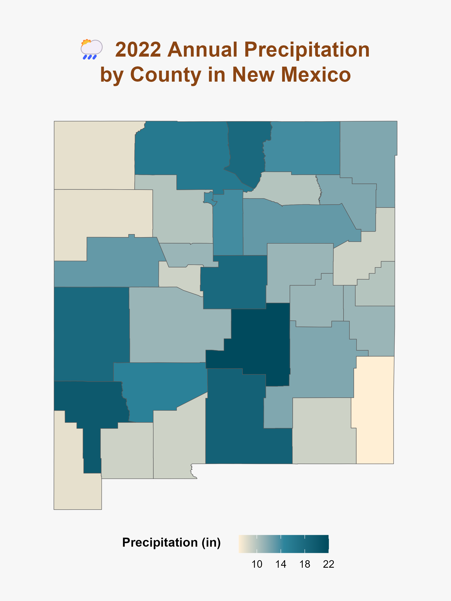
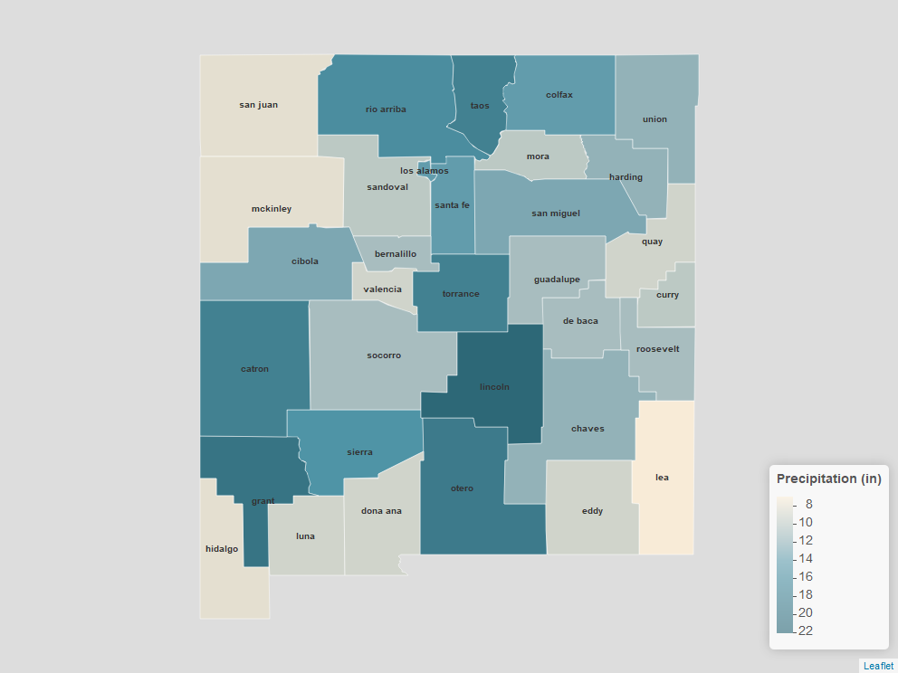

New Mexico Precipitation Choropleth Maps
================
Susan Threadgill
2025-09-08

## As part of my studies to better understand R Graphics Packages, I have delved into building both a static and interactive Choropleth map of the annual precipitation in New Mexico, by county, in 2022.

I chose this specifically because I live in New Mexico, and am trying to
stay up to date on our environment. Rainfall and water are two major
concerns for New Mexicans given our desert landscape and climate change.

``` r
# Libraries
library(tidyverse)
library(tigris)
library(sf)
library(stringr)
library(ggtext)
```

# Step 1: Load and clean your precipitation data from the CSV

``` r
# Step 1: Load and clean your precipitation data from the CSV
precip_data <- read.csv("2022-Annual-Preciptation-By-County.csv", header = FALSE)

# Fix column names and clean County names
colnames(precip_data) <- c("County", "Year", "Precipitation")
precip_county <- precip_data %>%
  drop_na() %>%
  mutate(
    County = str_to_lower(County),                      # lowercase
    County = str_replace_all(County, "[^a-z ]", ""),    # remove accents/punctuation
    County = str_trim(County),
    Precipitation = as.numeric(Precipitation),
    # Fix known mismatches
    County = case_when(
      County == "dona ana" ~ "dona ana",  # force consistent spelling
      TRUE ~ County
  ))
```

# Step 2: Get NM county shapefile and clean County names the same way

``` r
# Step 2: Get NM county shapefile and clean County names the same way
nm_counties <- counties(state = "NM", cb = TRUE, class = "sf") %>%
  mutate(
    County = str_to_lower(NAME),
    County = str_replace_all(County, "[^a-z ]", ""),
    County = str_trim(County),
    County = case_when(
      County == "doa ana" ~ "dona ana",  # CSV spelling
      TRUE ~ County
    )
  ) %>%
  select(County, geometry)
```

# Step 3: Merge shapefile and precipitation data

``` r
# Step 3: Merge shapefile and precipitation data
nm_counties_by_precipitation <- left_join(nm_counties, precip_county, by = "County")
```

# Step 4: Plot Choropleth

``` r
# Step 4: Plot choropleth
Basic_map <- ggplot(nm_counties_by_precipitation) +
  geom_sf(aes(fill = Precipitation)) +
  scale_fill_gradientn(
    colors = c("#FFEFD5", "#2e859c","#004a5d"),
    name = "Precipitation (in)   "
  ) +
  labs(title = "<span style='color:#004a5d'>🌦️</span>&nbsp;<span style='color:#8B4513'>
       2022 Annual Precipitation by County in New Mexico</span>") + 
  theme_void(base_size = 14) +
# Change background
  theme(
    plot.background = element_rect(fill = "#f7f7f7", color = NA),
    panel.background = element_rect(fill = "#f7f7f7", color = NA),
    # Title (enable markdown/HTML rendering)
    plot.title = element_textbox(
      size = 20, face = "bold", 
      hjust = 0.5, halign = 0.5,  # center text in box
      width = unit(0.9, "npc"),
      lineheight = 1.2,
      color = NA, # text color handled by spans above
      fill = "#f7f7f7", # setting same as plot bg
      padding = margin(10, 15, 10, 15), # top, right, bottom, left padding inside title box
      margin = margin(t = 5, b = 5), # space around the whole title box
    ),
    # Legend styling
    legend.position = "bottom",
    legend.box = "vertical",          # legend + title in same vertical box
    legend.box.just = "top",          # align to top
    legend.title    = element_text(size = 12, face = "bold", vjust= 0.9),
    legend.text     = element_text(size = 10),
    # Add bottom padding so legend sits "midway"
    plot.margin = margin(t = 25, r = 25, b = 30, l = 25)
  )
# Save the plot as a PNG file
ggsave("precip_map.png", Basic_map, width=6, height=8)
```

\#Generated Map 

\#Creating interactive map to show county names

``` r
library(leaflet)
library(mapview)
library(webshot)   # legacy, but needed for mapshot()
library(webshot2)  # makes mapshot work
```

# Reproject counties to WGS84 for leaflet

``` r
# Reproject counties to WGS84 for leaflet
nm_counties_by_precipitation <- st_transform(nm_counties_by_precipitation, 4326)
```

# Define color palette

``` r
pal <- colorNumeric(
  palette = c("#FFEFD5", "#2e859c", "#004a5d"),
  domain = nm_counties_by_precipitation$Precipitation)
```

\#Get bounding box for map and add safe label points inside counties

``` r
# Get bounding box
bb <- st_bbox(nm_counties_by_precipitation)

# Safe label points inside counties
county_labels <- st_point_on_surface(nm_counties_by_precipitation)
```

\#Create Interactive Map

``` r
interactive_nm_map <- leaflet(nm_counties_by_precipitation,
                              options = leafletOptions(minZoom = 7, maxZoom = 9)) %>%
  
  # Choropleth layer
  addPolygons(
    fillColor = ~pal(Precipitation),
    color = "white", weight = 1, fillOpacity = 0.8,
    label = ~paste0(County, ": ", Precipitation, " in"),
    group = "Precipitation"
  ) %>%
  
  # Toggleable county labels
  addLabelOnlyMarkers(
    data = county_labels,
    label = ~County,
    labelOptions = labelOptions(
      noHide = TRUE, direction = "center", textOnly = TRUE,
      style = list("font-weight" = "bold", "color" = "#333333")
    ),
    group = "County Names"
  ) %>%

  # Add legend
  addLegend(
    pal = pal, values = ~Precipitation,
    title = "Precipitation (in)",
    position = "bottomright"
  ) %>%
  
  # Add layer controls (checkbox for County Names)
  addLayersControl(
    overlayGroups = c("County Names"),
    options = layersControlOptions(collapsed = FALSE)
  ) %>%
  # Fit to NM bounds (xmin, ymin, xmax, ymax)
  fitBounds(
    lng1 = as.numeric(bb["xmin"]),
    lat1 = as.numeric(bb["ymin"]),
    lng2 = as.numeric(bb["xmax"]),
    lat2 = as.numeric(bb["ymax"])
  ) %>%
  # Lock to NM
  setMaxBounds(
    lng1 = as.numeric(bb["xmin"]),
    lat1 = as.numeric(bb["ymin"]),
    lng2 = as.numeric(bb["xmax"]),
    lat2 = as.numeric(bb["ymax"]) 
  )
```

\#Generate Map

### Static snapshot of interactive leaflet map

<figure>

<figcaption aria-hidden="true">Precipitation (leaflet
snapshot)</figcaption>
</figure>

### Full interactive map

[Click here to view the interactive precipitation
map](precip_leaflet.html)
