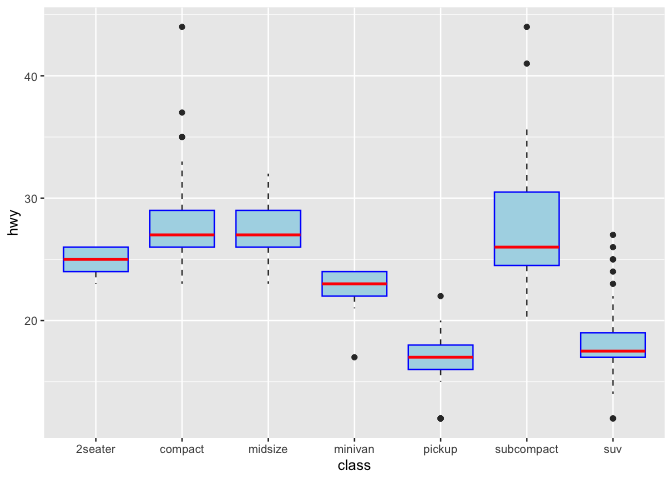
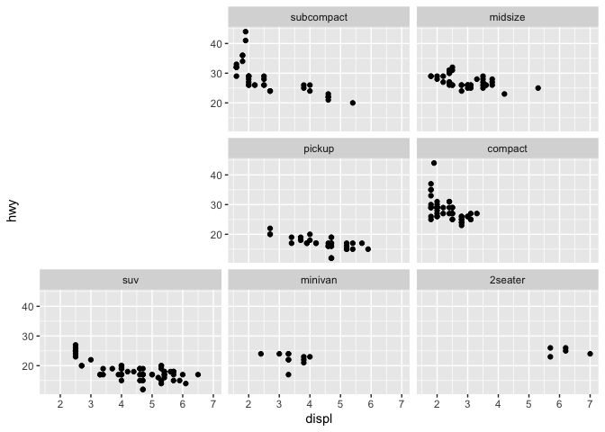
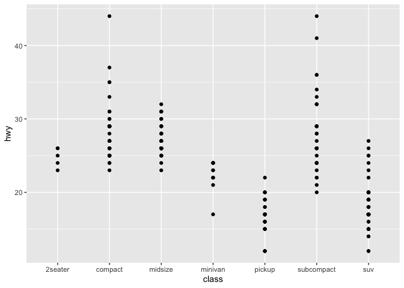

ggplot2 4.0 Beginner Practice (Play & Explore)
================

# 🖼️ ggplot2 4.0.0 — Beginner-Friendly Overview

Most of your old plots will still work the same, but here are the big
wins in version 4.0.0:

- 🎨 **Themes got easier**: more automatic styling (ink = main elements,
  paper = background, accent = highlights).
- 🗂️ **Facets (small multiples)**: more layout options, panels can size
  to their data, and flexible data repetition.
- 📊 **Geoms (shapes)**: Boxplots, violins, and labels have more styling
  options; area/ribbon plots can use gradients.
- 🎛️ **Scales & axes**: minor ticks for categorical axes, easier axis
  reversal, and smarter secondary axes.
- 📝 **Labels**: can auto-use variable labels or a dictionary you
  provide.
- 🛠️ **Errors**: clearer error messages when you give bad input.

👉 Bottom line: plots still work the same, but you get more control and
friendlier defaults.

------------------------------------------------------------------------

# 🔄 Updating ggplot2

To make sure you have the latest version:

``` r
install.packages("ggplot2")   # Install/update from CRAN
```

------------------------------------------------------------------------

# 🔍 Checking your ggplot2 version

Run this to see your version:

``` r
utils::packageVersion("ggplot2")
```

    ## [1] '4.0.0'

It should print `‘4.0.0’` (or higher).

------------------------------------------------------------------------

# 🔎 Exploring arguments and inputs

To see what arguments are available for any function, use:

``` r
args(geom_boxplot)      # See arguments for boxplots
?geom_boxplot           # Open the help page
```

You can also press **Tab** after a function name in RStudio to
autocomplete options.

------------------------------------------------------------------------

# 🚀 Practice Examples

Each example highlights one beginner-friendly feature of ggplot2 4.0.0,
with ideas for things you can try.

------------------------------------------------------------------------

## 1. Style boxplots more easily

Look for: light blue box fill, red median line, dashed whiskers.

``` r
ggplot(mpg, aes(class, hwy)) +
  geom_boxplot(
    fill = "lightblue",        # inside the box
    box.colour = "blue",       # outline of the box
    median.colour = "red",     # median line
    whisker.linetype = "dashed"
  )
```

<!-- -->

``` r
# 👉 Try changing fill = "pink" or "green" to experiment.
# 👉 Map a variable: geom_boxplot(aes(fill = drv)) to color by drive type.
# 👉 Adjust median.linetype = "dotted" or median.linewidth = 2.
```

------------------------------------------------------------------------

## 2. Try facet layouts

Look for: small multiples starting bottom-right, wrapping across rows.

``` r
ggplot(mpg, aes(displ, hwy)) +
  geom_point() +
  facet_wrap(~class, dir = "br")  # bottom-right start
```

<!-- -->

``` r
# 👉 Try dir = "tl", "rb", or "tr" to see different starting corners.
# 👉 Try facet_grid(drv ~ cyl) for a grid layout instead of wrap.
# 👉 Add scales = "free" to let each panel set its own axis limits.
```

------------------------------------------------------------------------

## 3. Add minor ticks to categorical axes

Look for: tiny extra tick marks on the x-axis (between categories).

``` r
ggplot(mpg, aes(class, hwy)) +
  geom_point() +
  scale_x_discrete(minor_breaks = 1:7)
```

<!-- -->

``` r
# 👉 Try scale_y_continuous(minor_breaks = seq(10, 50, by = 2)).
# 👉 Remove them: scale_x_discrete(minor_breaks = NULL).
```

------------------------------------------------------------------------

## 4. Gradient fills in area plots

Look for: area shaded with a gradient that changes with unemployment
levels.

``` r
ggplot(economics, aes(date, unemploy, fill = unemploy)) +
  geom_area()
```

<!-- -->

``` r
# 👉 Try changing fill = pop to see population instead of unemployment.
# 👉 Try geom_ribbon(aes(ymin = unemploy - 500, ymax = unemploy + 500, fill = unemploy)).
```

------------------------------------------------------------------------

## 5. Use a label dictionary

Look for: axis labels automatically replaced with nicer text.

``` r
labels <- c(displ = "Engine Size (L)", hwy = "Highway MPG")

ggplot(mpg, aes(displ, hwy)) +
  geom_point() +
  labs(dictionary = labels)
```

<!-- -->

``` r
# 👉 Add more entries to the dictionary to rename multiple variables at once.
# 👉 Try labs(title = "Car Efficiency", subtitle = "Displacement vs Highway MPG").
```
